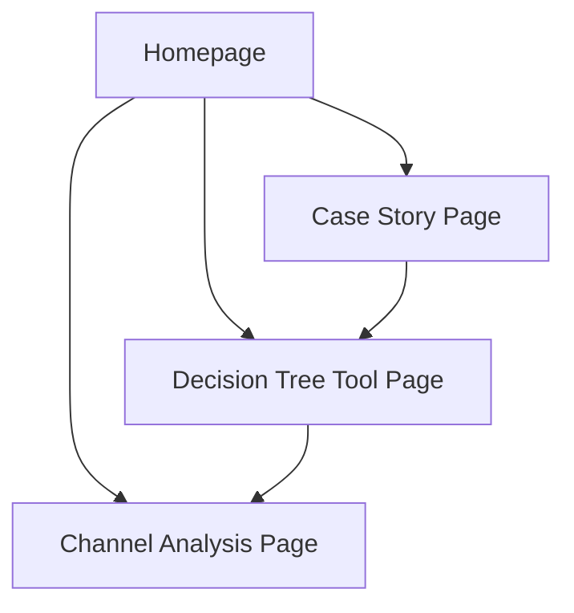
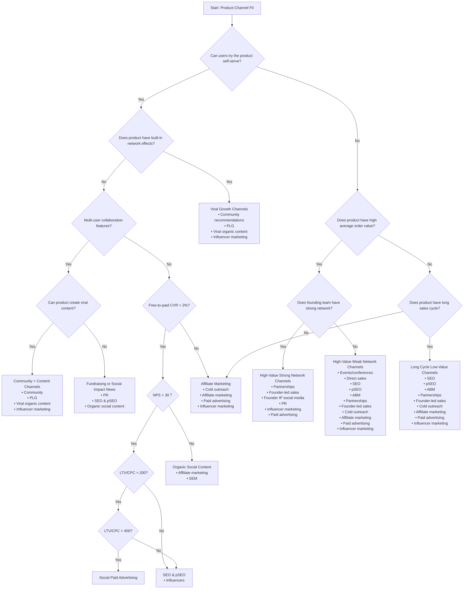

## 1. Product Overview
Product-Channel Fit Guide is an interactive visual tutorial platform that demonstrates how to find the optimal match between products and channels through real-world cases.
- Helps entrepreneurs and product managers understand the importance of product-channel fit, avoiding blind trial-and-error spending.
- Provides practical channel selection guidance framework through decision tree visualization and case analysis.

## 2. Core Features

### 2.1 Feature Module
Our Product-Channel Fit Guide contains the following core pages:
1. **Homepage**: Hero section showcasing core story, navigation menu, core value proposition
2. **Case Story Page**: Detailed journey from failure to success, including data visualization
3. **Decision Tree Tool Page**: Interactive product-channel fit decision flow chart
4. **Channel Analysis Page**: Detailed analysis of various marketing channels and applicable scenarios

### 2.2 Complete Decision Tree Structure

The product-channel fit decision tree based on the diagram contains the following complete paths:

#### 2.2.1 Core Decision Nodes
1. **Product Self-Service Capability Assessment**
   - Can users try the product self-serve?
   - Yes: Proceed to network effects assessment
   - No: Proceed to order value assessment

2. **Network Effects Assessment** (when product supports self-service)
   - Does the product have built-in network effects?
   - Yes: Recommend viral growth channels
   - No: Proceed to paid conversion rate assessment

3. **Order Value Assessment** (when product doesn't support self-service)
   - Does the product have high average order value?
   - Yes: Proceed to founding team network assessment
   - No: Proceed to sales cycle assessment

4. **Founding Team Network Assessment** (high order value products)
   - Does the founding team have a strong industry network?
   - Yes: Recommend partnership and founder-led sales channels
   - No: Recommend events/conferences and direct sales channels

5. **Sales Cycle Assessment** (low order value products)
   - Does the product have a long sales cycle?
   - Yes: Recommend ABM, partnerships, founder-led sales
   - No: Recommend cold outreach, affiliate marketing, paid ads, influencer marketing

#### 2.2.2 Channel Recommendation Matrix

**Viral Growth Path** (Self-service + Network Effects):
- Community recommendations
- PLG (Product-Led Growth)
- Viral organic content
- Influencer marketing

**Paid Acquisition Path** (Self-service + No Network Effects):
- Free-to-paid conversion rate > 2%: Organic social content, affiliate marketing, SEM
- NPS > 30: SEO & pSEO, influencers
- LTV/CPC > 200: SEO & pSEO, influencers
- LTV/CPC > 400: Social paid advertising

**High-Value Sales Path** (Non-self-service + High Order Value):
- Strong network: Partnerships, founder-led sales, founder IP social media, PR, influencer marketing, paid ads
- Weak network: Events/conferences, direct sales, SEO, pSEO, ABM, partnerships, founder-led sales, cold outreach, affiliate marketing, paid ads, influencer marketing

**Low-Value Sales Path** (Non-self-service + Low Order Value):
- Long sales cycle: SEO, pSEO, ABM, partnerships, founder-led sales, cold outreach, affiliate marketing, paid ads, influencer marketing
- Short sales cycle: Cold outreach, affiliate marketing, paid ads, influencer marketing

### 2.3 Page Details

| Page Name | Module Name | Feature Description |
|-----------|-------------|---------------------|
| Homepage | Hero Section | Display core story title "Tried 20+ channels, burned $200M, then found product-channel fit", including engaging visual elements and CTA button |
| Homepage | Twitter Source Attribution | Display original tweet quote and link to source: "Tried 20+ channels. Burned $200M+ cash. Burned out. Then we found product-channel fit — and growth took off. Here's what we tried (and what actually worked):" - @ChangChen_CC, including the decision tree image from /Users/bytedance/Workspace/dev0_projects/渠道增长/assets/pcf.png |
| Homepage | Navigation Menu | Provide clear site navigation with links to all major pages |
| Homepage | Value Proposition Section | Concisely explain why product-channel fit is so important, showcase key statistics |
| Case Story Page | Failure Journey Display | Visualize the 20+ channels tried and reasons for failure, including timeline and cost analysis |
| Case Story Page | Success Turning Point | Detailed explanation of how to find the right product-channel fit, including key insights |
| Case Story Page | Data Visualization | Display charts and data comparing costs, time, and effectiveness |
| Decision Tree Tool Page | Complete Decision Flow Chart | Implement the complete decision tree from section 2.2.1 above, including all decision nodes and branch paths |
| Decision Tree Tool Page | Interactive Q&A System | Users answer questions about product characteristics, system automatically navigates to corresponding channel recommendations |
| Decision Tree Tool Page | Channel Recommendation Results | Display recommended marketing channel combinations based on decision path, including priority ranking |
| Channel Analysis Page | Detailed Channel Descriptions | Show detailed information, cost structure, and applicable scenarios for all channels mentioned in the decision tree |
| Channel Analysis Page | Success Case Studies | Comparative analysis of success and failure cases for each channel |

## 3. Core Process

### 3.1 User Operation Flow
1. Users visit the homepage to understand core value proposition and story background
2. Enter the case story page to deeply understand the complete journey from failure to success
3. Use the decision tree tool page to get personalized channel recommendations through interactive Q&A
4. View detailed analysis of recommended channels on the channel analysis page

### 3.2 Page Navigation Flow

### 3.3 Complete Decision Tree Flow

## 4. User Interface Design

### 4.1 Design Style - Pixel Art Theme (Minecraft-inspired)
- Primary colors: Grass Green (#7CB342), Stone Gray (#616161), and Gold (#FFD700) as accent color
- Secondary colors: Dirt Brown (#8D6E63), Sky Blue (#42A5F5), Redstone Red (#F44336)
- Button style: Pixelated rectangular buttons with 8-bit style borders, no rounded corners, blocky shadow effects
- Typography: Pixel/monospace fonts (e.g., 'Minecraft', 'Press Start 2P', or 'Courier New'), headings use 16-24px, body text uses 12-16px
- Layout style: Grid-based blocky design mimicking Minecraft blocks, top navigation bar, pixelated borders
- Icon style: 16x16 or 32x32 pixel art icons, blocky and geometric, inspired by Minecraft item icons
- Visual elements: Block textures, pixelated gradients, 8-bit style animations, blocky shadows

### 4.2 Page Design Overview - Pixel Art Implementation

| Page Name | Module Name | UI Elements |
|-----------|-------------|-------------|
| Homepage | Hero Section | Pixelated title with blocky text effect, background using Minecraft-style block patterns (grass, stone, dirt), CTA button styled as a Minecraft button with gold accent |
| Homepage | Twitter Source Attribution | Styled tweet quote box with Twitter bird icon, author attribution, and clickable link to original tweet (https://x.com/ChangChen_CC/status/1950375812324295053) |
| Homepage | Navigation Menu | Fixed top navigation with stone block texture background, pixelated text, blocky hover effects with redstone glow |
| Case Story Page | Data Visualization | Pixel art charts with blocky bars and lines, use Minecraft color palette, animated with 8-bit style transitions |
| Decision Tree Tool Page | Complete Decision Flow Chart | Implement decision tree with Minecraft block-style nodes, decision nodes as diamond ore blocks, result nodes as chest blocks, connecting paths as redstone wire with animated flow |
| Decision Tree Tool Page | Interactive Q&A Interface | Left side shows question in a book-style interface (like Minecraft enchanting table), right side shows minimap-style progress tracker |
| Decision Tree Tool Page | Channel Recommendation Results | Results displayed as inventory slots grid, each channel as an item with pixel art icon, tooltip shows stats on hover |
| Channel Analysis Page | Channel Detail Cards | Each channel styled as Minecraft item frame with block texture background, stats displayed as experience bars, difficulty shown as star rating |
| Channel Analysis Page | Channel Comparison Tool | Comparison interface styled as crafting table, radar chart replaced with blocky bar charts using Minecraft block heights |

### 4.3 Responsiveness - Pixel Art Adaptation
Desktop-first design maintaining pixel art aesthetic across all screen sizes. Mobile adaptation preserves blocky design elements with larger touch targets. Pixel art scales proportionally to maintain crisp edges. Decision tree tool optimized for touch with larger block-style buttons and swipe gestures for navigation.